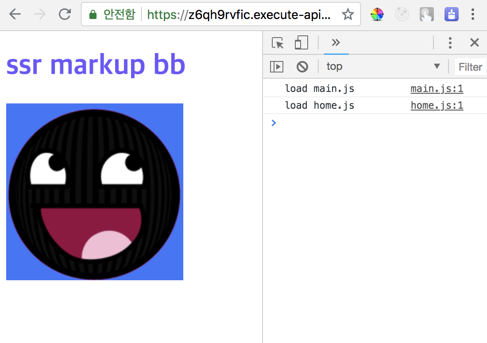

# aws-lambda-ssr-poc



## Usage

```
$ serverless deploy
```

## using API custom domain in AWS
> https://github.com/u4bi-store/aws-lambda-custom-domain

> **commit logs**
>
> - [Added serverless-domain-manager to package.json](https://github.com/u4bi-store/aws-lambda-custom-domain/commit/b3984df6f623c22747ada395fb28337fa1ae474e)
> - [Added support for customDomain.](https://github.com/u4bi-store/aws-lambda-custom-domain/commit/64e07269969d0c4494416ab3483f6b5d91a37832)
> - [Delete dev url.](https://github.com/u4bi-store/aws-lambda-custom-domain/commit/d094a9de0d1d5e885da73d6dabf4e06be1e35f87)